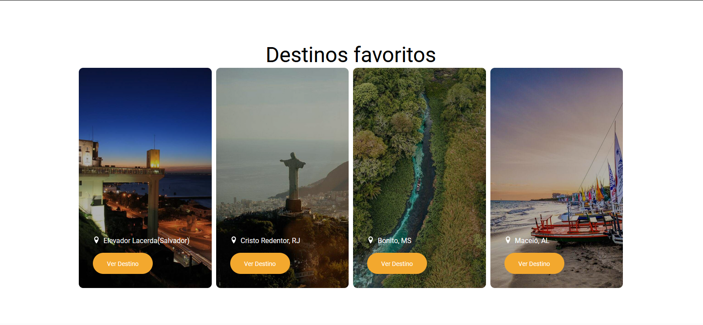
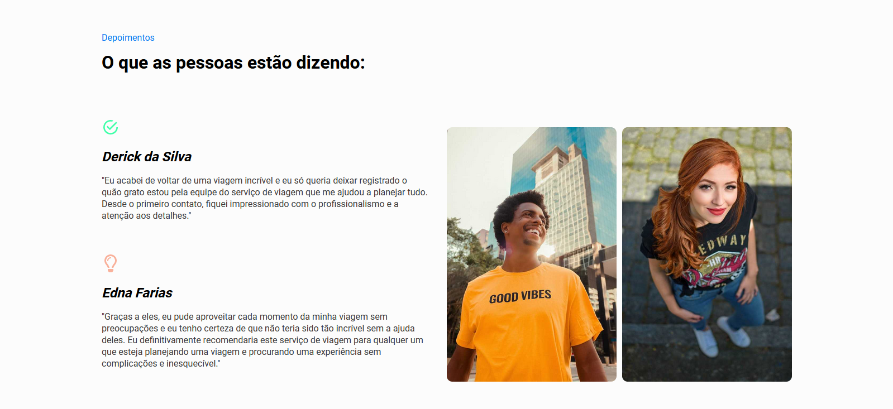
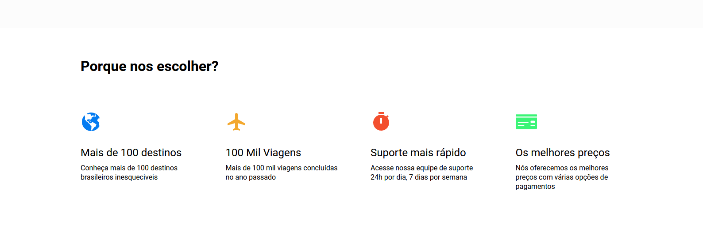
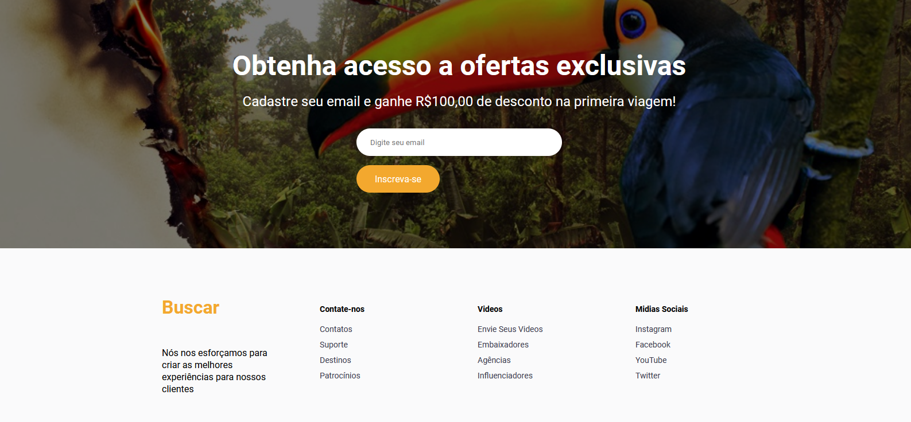

<!-- AUTO-GENERATED-CONTENT:START (STARTER) -->
<p align="center">
  <a href="https://www.gatsbyjs.com">
    
  </a>
</p>
<h1 align="center">
  ✈️ Travel Destinations 🏖️
</h1>
Welcome, this project is a Brazilian travel responsive website.


##  👀 Preview







## 📂  Access to the project
You can access the source code of the [download code](https://github.com/Jezebel1990/travel-destinations.git)or access the [website here](https://oval-plstravel.surge.sh/)


## 🚀 Quick start 

1.  **Local access**

    Navigate into your new site’s directory and start it up.

    ```shell
    cd travel-destinations/
    gatsby develop
    ```

1.  **Open the source code and start! **

    Your site is now running at `http://localhost:8000`!

    Note: You'll also see a second link: `http://localhost:8000/___graphql`. This is a tool you can use to experiment with querying your data. Learn more about using this tool in the [Gatsby Tutorial](https://www.gatsbyjs.com/docs/tutorial/getting-started/part-4/#use-graphiql-to-explore-the-data-layer-and-write-graphql-queries).


## ⚙️ Technologies
- React 
- JavaScript
- Gatsby
- GraphQL


## 🧐 What's inside?

A quick look at the top-level files and directories you'll see in a typical Gatsby project.

    .
    ├── node_modules
    ├── src
      ├── assets
      ├── components
         ├── styles
         ├── data
    ├──  pages
    ├── .gitignore
    ├── gatsby-browser.js
    ├── gatsby-config.js
    ├── gatsby-node.js
    ├── gatsby-ssr.js
    ├── LICENSE
    ├── package.json
    └── README.md

## 🎓 Learning Gatsby

Looking for more guidance? Full documentation for Gatsby lives [on the website](https://www.gatsbyjs.com/). Here are some places to start:

- **For most developers, we recommend starting with our [in-depth tutorial for creating a site with Gatsby](https://www.gatsbyjs.com/docs/tutorial/getting-started/).** It starts with zero assumptions about your level of ability and walks through every step of the process.

- **To dive straight into code samples, head [to our documentation](https://www.gatsbyjs.com/docs/).** In particular, check out the _Guides_, _API Reference_, and _Advanced Tutorials_ sections in the sidebar.


Made with ♥ by [Jezebel Guedes](https://www.linkedin.com/in/jezebel-guedes/) 👋 Get in touch!

<!-- AUTO-GENERATED-CONTENT:END -->
